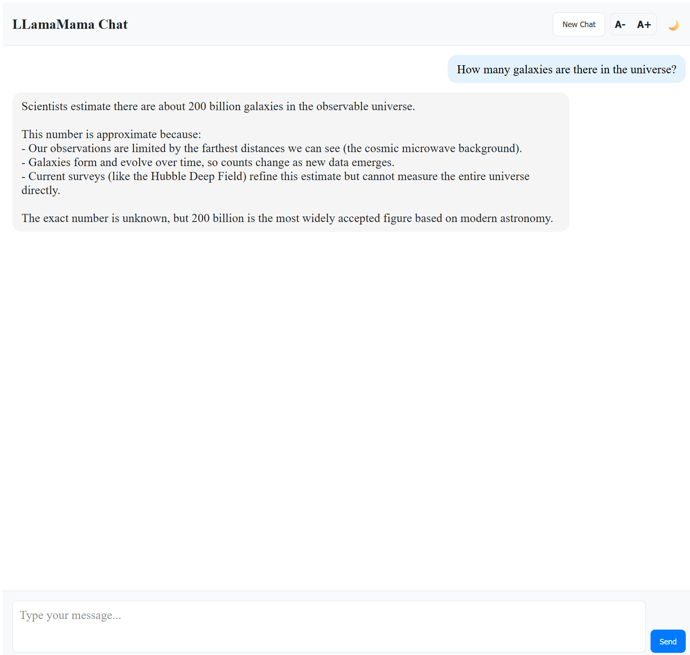

# LLamaMama is a chat interface for communicating with a running Ollama instance (default model: `qwen3:4B`).


## Installation

To get this project up and running on your local machine, follow these steps:

1.  **Create a virtual environment:**
    It's recommended to use a virtual environment to manage project dependencies.
    ```bash
    python -m venv .venv
    ```

2.  **Activate the virtual environment:**
    *   **Windows:**
        ```bash
       
        .venv\Scripts\activate
        ```
    *   **macOS/Linux:**
        ```bash
        source .venv/bin/activate
        ```

3.  **Install dependencies:**
    Install Django.
    ```bash
    pip install Django
    ```
4.  **Run database migrations:**
    Apply the initial database migrations for Django's built-in apps.
    ```bash
    python manage.py migrate
    ```

5.  **Create a superuser (optional):**
    To access the Django admin interface, you will need to create a superuser.
    ```bash
    python manage.py createsuperuser
    ```
    Follow the prompts to set up your username, email, and password.

6.  **Start the development server:**
    ```bash
    python manage.py runserver
    ```
    The application will be accessible at `http://127.0.0.1:8000/`. You can access the admin interface at `http://127.0.0.1:8000/admin/`.

## License

MIT License

Copyright (c) 2025 The LLamaMama Project Contributors

Permission is hereby granted, free of charge, to any person obtaining a copy
of this software and associated documentation files (the "Software"), to deal
in the Software without restriction, including without limitation the rights
to use, copy, modify, merge, publish, distribute, sublicense, and/or sell
copies of the Software, and to permit persons to whom the Software is
furnished to do so, subject to the following conditions:

The above copyright notice and this permission notice shall be included in all
copies or substantial portions of the Software.

THE SOFTWARE IS PROVIDED "AS IS", WITHOUT WARRANTY OF ANY KIND, EXPRESS OR
IMPLIED, INCLUDING BUT NOT LIMITED TO THE WARRANTIES OF MERCHANTABILITY,
FITNESS FOR A PARTICULAR PURPOSE AND NONINFRINGEMENT. IN NO EVENT SHALL THE
AUTHORS OR COPYRIGHT HOLDERS BE LIABLE FOR ANY CLAIM, DAMAGES OR OTHER
LIABILITY, WHETHER IN AN ACTION OF CONTRACT, TORT OR OTHERWISE, ARISING FROM,
OUT OF OR IN CONNECTION WITH THE SOFTWARE OR THE USE OR OTHER DEALINGS IN THE
SOFTWARE.
